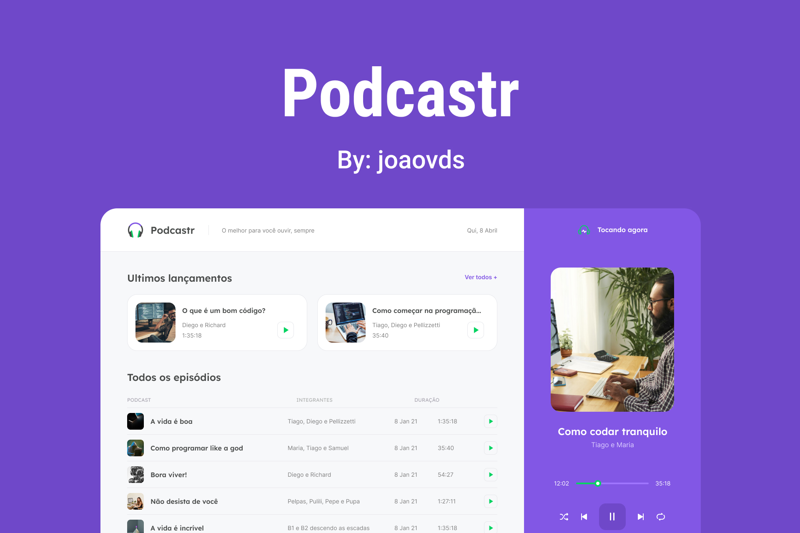

<div align="center">
  
  <h1>Podcastr</h1>
  <p>
    :headphones: A platform built for podcast broadcasting. :headphones:
  </p>
  <p>
    
    <a href="https://www.linkedin.com/in/jo%C3%A3o-victor-da-silva-a85907189/" target="_blank" rel="noopener noreferrer">
      
    </a>
    
  </p>
</div>

# :eyes: About

Podcastr is a platform for listening to podcasts; Developed for my training in ReactJS at the event #NLW5, using NextJS.

<div align="center">
  
</div>

<br>
<br>

# 🚀 Technologies

- [Node.js](https://nodejs.org/en/)
- [ReactJS](https://pt-br.reactjs.org/)
- [NextJS](https://nextjs.org/)
- [TypeScript](https://www.typescriptlang.org/)
- [Sass](https://sass-lang.com/)

<br>

## :computer: Getting started

### Requirements

- [Node.js](https://nodejs.org/en/)
- [Yarn](https://classic.yarnpkg.com/) or [NPM](https://www.npmjs.com/)

<br>

### Installing and running the project

_Clone the project and access the folder_

```bash
$ git clone https://github.com/joaovds/Podcastr.git
$ cd Podcastr
```

_Follow the steps below_

```bash
# Install the dependencies
$ yarn install

# run the application
$ yarn dev

# Well done, Podcastr is started!
```

<br>
<br>

## :pencil: License

This project is licensed under the MIT License - see the [LICENSE](LICENSE) file for details.

<hr>
<div align="center">
  <sub>Copyright © 2021-present, joaovds.</sub>
</div>
<hr>
